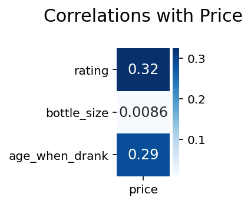
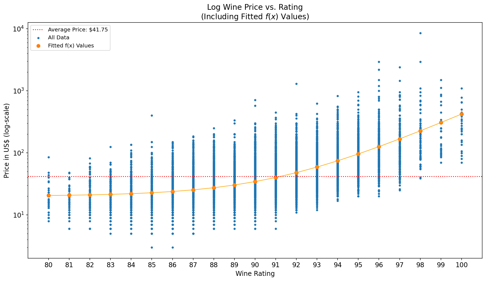

# Predicting Wine Prices with Data
## General Assembly Data Science Immersive Capstone Project
*By Jack Lodge, May 2021*

**INTRO**

This project was completed independently over the course of 4 weeks as part of the General Assembly Data Science Immersive course. The principal goal of the investigation was to build a model capable of predicting wine prices based on a number of different features and a brief, descriptive review from professional wine critics.

**BACKGROUND**

The wine trade was estimated to be worth over $325bn in 2020, and is expected to continue growing at around 5% year-on-year for the next 7 years. With such a large amount of money being spent on wine, being able to estimate the prices of wines based on their features alone would prove very useful to those in the wine trade, both in providing assurances of their transactions as well as being able to spot outliers that may suggest a wine being over or under priced.

**GOALS**

Using information scraped from a wine review website, I aimed to build a model to predict the prices of wine based on a number of features of the wines, including a short review and rating score given by professional wine critics.

The project was carried out in several stages:
1. Acquiring a dataset - a web-scraper was built to collect and parse the data
2. Cleaning the data - the dataset was examined to identify any errors or inconsistencies
3. Exploratory data analysis - analysing the dataset and the relationships within it to search for any trends
4. Modelling - a number of different modelling techniques were carried out and tested on unseen data to try and predict wine prices
5. Evaluation - the effectiveness of the different models is discussed
6. Areas for further investigation - potential future avenues for exploration
7. Conclusions

The Jupyter Notebook with the related code can be found [here](Predicting_Wine_Prices.ipynb), and the necessary assets to run the code (such as the dataset and saved models, to save time from fitting and optimising again) can be found in the `assets` folder within this repo.

1. **ACQUIRE DATA**

Using the requests and Beautiful Soup Python packages I was able to scrape and parse data from the Wine Enthusiast website over the course of two weeks, collecting a number of different features of each wine and their associated prices. This gave me a dataset of 47,674 wines from a wide range of regions, prices and styles.

2. **DATA CLEANING**

After parsing the data into a DataFrame, utilising the pandas Python package, I had a table of 18 different features. Using a simple regular expression I was also able to extract the vintage of each wine from their titles and also calculate an approximate age of the wine when it was drunk by subtracting the vintage year from the year when the review was published, resulting in the below fields. It is important to note that all the reviews and ratings are conducted blind, so there is no bias of the price of the wine when the reviewers were forming their opinions; there was no information leakage.

|Feature|Description|
|---|---|
|<b>title</b>|The name of the wine|
|<b>review</b>|The subjective description of the profile of the wine|
|<b>reviewer</b>|The name of the professional reviewer who tasted the wine|
|<b>rating</b>|A points system indicating the quality of the wine|
|<b>price</b>|The price of the wine in US\$|
|<b>designation</b>|The particular brand of the wine, where applicable|
|<b>variety</b>|The grape varieties, blends or styles of the wine, as appropriate for the given wine|
|<b>country</b>|The country of origin|
|<b>appellation</b>|The region in which the wine was made|
|<b>sub_region1</b>|A second, more granular region in which the wine was made (where applicable)|
|<b>sub_region2</b>|A third, more granular region in which the wine was made (where applicable)|
|<b>winery</b>|The winemaker|
|<b>alcohol</b>|The fraction of the wine's alcohol by volume|
|<b>bottle_size</b>|The size of the wine bottle reviewed (ml)|
|<b>category</b>|The style of the wine (red, white, rose, sparkling etc.)|
|<b>importer</b>|The importing merchant of the wine (where applicable)|
|<b>date_published</b>|The date the review was published|
|<b>user_avg_rating</b>|The average user-submitted rating of the wine|
|<b>vintage</b>|The year in which the grapes were harvested|
|<b>age_when_drank</b>|The approximate age of the wine when it was reviewed|

The data was then initially cleaned by removing the `user_avg_rating` variable (as it was null in all cases, perhaps a feature the site was looking to incorporate previously) and removing any wines without prices listed. I then moved onto investigating discrepancies in some of the other fields, which I have detailed below.

*Alcohol*
- There were a number of wines with ABV well above the expected maximum value of around 20-25% (for fortified wines), and some were even above 100% ABV
- Upon further inspection, these errors were mostly attributed to problems on the website itself, with the data entered not necessarily relating to the wines listed
- While the high ABV wines were easy enough to filter out, there were also problems with other ABVs being incorrectly stated compared to their real values, after carrying out some random spot checks on other sites
- Due to the difficulty in being able to verify which data were accurate, this column unfortunately had to be dropped as I did not want to pollute the dataset with erroneous information

*Duplicated wine reviews*
- Intuitively, every wine should have a unique review within the dataset as any duplicate entries were removed during the initial parsing stage, but this proved not to be the case
- In some of these cases the reviews had been incorrectly uploaded twice to different wines, and in other cases it was a case of a wine being uploaded twice but with very minor differences
- In the end this was a very small overall percentage of the dataset, so these duplicates were removed

*Duplicated wine titles*
- Again, we assume that each wine should have a unique name if it is a unique entry on the site
- Due to “old-world” naming conventions, where a wine is named after the region it is from rather than the grape varietal, it is possible for the same region to produce a white and a red wine with the same name
- There were also cases when the same wine was reviewed twice, but on different dates; given the potential for wine to change with age
- After filtering for unique entries across title, varietal and date of review, the number of duplicated titles had reduced from 593 wines to just 6, and these could be handled manually depending on the cause of the issue

3. **EXPLORATORY DATA ANALYSIS**

Now that I had a clean dataset I then started to investigate a number of the different features to better understand the relationships present.

First I analysed how wine prices within the dataset were distributed, which appeared to follow an inverse exponential distribution with a long tail of wines priced far, far higher than the median value (max was $8,500 versus a median of only $30).

Then, by implementing a simple correlation calculation of wine prices versus the remaining quantitative fields in my dataset (`rating`, `age_when_drank` and `bottle_size`), we calculated a fairly strong, positive correlation of `price` (my target variable) with both `rating` and `age_when_drank`, but essentially no correlation with `bottle_size`, as might be expected intuitively. It should be noted that in this calculation, given the ordinal nature of the rating variable, it was used as a quasi-continuous variable despite it more naturally falling as a categorical variable.

Finally, I wrote a short function to plot the distribution of wine prices for the other categorical variables present, although this was not viable to visualise for some of the categorical fields which had 100s of unique values.

Having noted a number of trends and/or delineating features within the data during the EDA stage, I then moved on to the modelling stage.

4. **MODELLING**

Initially I ran a simple linear regression on the numerical features within the dataset as a quick and simple benchmark, achieving an R2 value of around 0.25. The coefficients extracted from this model also support the initial correlation analysis I had carried out earlier, with both `rating` and `age_when_drank` having positive signs with relatively similar strengths, while `bottle_size` was much closer to zero.

Next I looked to incorporate the categorical features within the model, which required one-hot encoding for each category. However, when applied to all of the categorical features available, this did result in a huge increase in dimensionality of my dataset to over 11,000 features described by a sparse matrix. This meant that further modelling should be carried out by methodologies which can capitalise on sparse matrix inputs, such as stochastic gradient descent regression (SGDR).

After carrying out a grid search across several hyperparameters, the SGDR achieved an R2 score of around 0.36 on test data unseen by the model during the fitting process, meaning we could now explain just over a third of the variance in wine prices using our model.

5. **MODEL EVALUATION**

A residual plot shows a fair amount of scope for improvement, which we had already assumed given the R2 score attained by the SGDR model. There was considerable heteroscedasticity present in the residuals, with the model performing poorest in predicting higher priced wines. There were also occasions when the model predicted negative prices for wines, which is clearly not possible. The model also often overestimated the prices of wines, perhaps due to certain cheaper wines sharing many characteristics with wines that usually attract a higher value.

6. **AREAS FOR FURTHER INVESTIGATION**

Now that we have generated a model with the features of our wines, I looked into other ways that I might be able to improve upon what has already been done. These fell into three different categories.

*Dimensionality reduction*
- Usually we could employ techniques such as principal component analysis (PCA) to define a new set of orthogonal axes within the feature space to optimise a trade-off between retained dimensions and retained variance/information within the data
- Alternatively, multiple correspondence analysis (MCA) attempts to accomplish a similar result but with one-hot encoded categorical features by attempting to cluster features that often indicate in the same direction (e.g. hypothetically if all French wines were red then they would always both indicate 1 in those columns, arguably providing redundant information)
- However, after attempting to apply this to my dataset it proved to result in too much information loss for too little reduction in dimensionality, not to mention increased complexity of relating the new coordinate system back to the original variables

*Natural Language Processing of Reviews*
- By incorporating the text from each wine, also in one-hot encoded sparse matrix format, we could try to identify key words from the wine titles and reviews that could provide predictive power in regards to modelling wine prices
- Using the SGDR on the text sparse matrix achieved an R2 of around 0.18
- Incorporating the NLP and categorical feature sparse matrices into one larger model is an area for further study

*Feature Engineering*
- It was observed and noted in the EDA stage that the rating feature, when used in its quasi-continuous form (as previously discussed) that an exponential relationship was evident
- An exponential function, f(x) = aeb(x-c) + d with a, b, c and d all constants and x as wine rating in this instance, was fitted, and visually appeared to be a good way to relate the two variables
- By applying a transformation using the fitted relationship above, we may be able to improve the predictive power of the rating variable in future modelling

These areas for improvement are still somewhat of a work in progress, and publishing these findings publicly will follow in short order.

7. **CONCLUSIONS**

Overall this project has been fascinating to work on, both as a wine aficionado and as an introduction to data science. Tackling issues around acquiring and cleaning data, dealing with very high dimension feature spaces and which models are the most appropriate to apply in such circumstances has been intriguing to investigate.

While the model R2 score on test data is not remarkably high, at only 0.36, there are also considerations for future work to include the NLP and feature engineering methods outlined above which may help to improve this score. Correctly predicting the incredibly high priced wines also proved very difficult for the model, so either an understanding of the limitations of the model’s application or further features to aid in delineating in these outlier cases would also help the model generalise better in the future. That being said, it would also be worth investigating the wines with significantly higher predicted prices than reality, as these could potentially represent under-priced wines given shared characteristics with similar, more expensive bottles.

Finally I want to note that this project is still a work in progress, and updates will be shared as they are developed.

Many thanks to all the team at General Assembly for their invaluable input in getting this project to its current stage.
